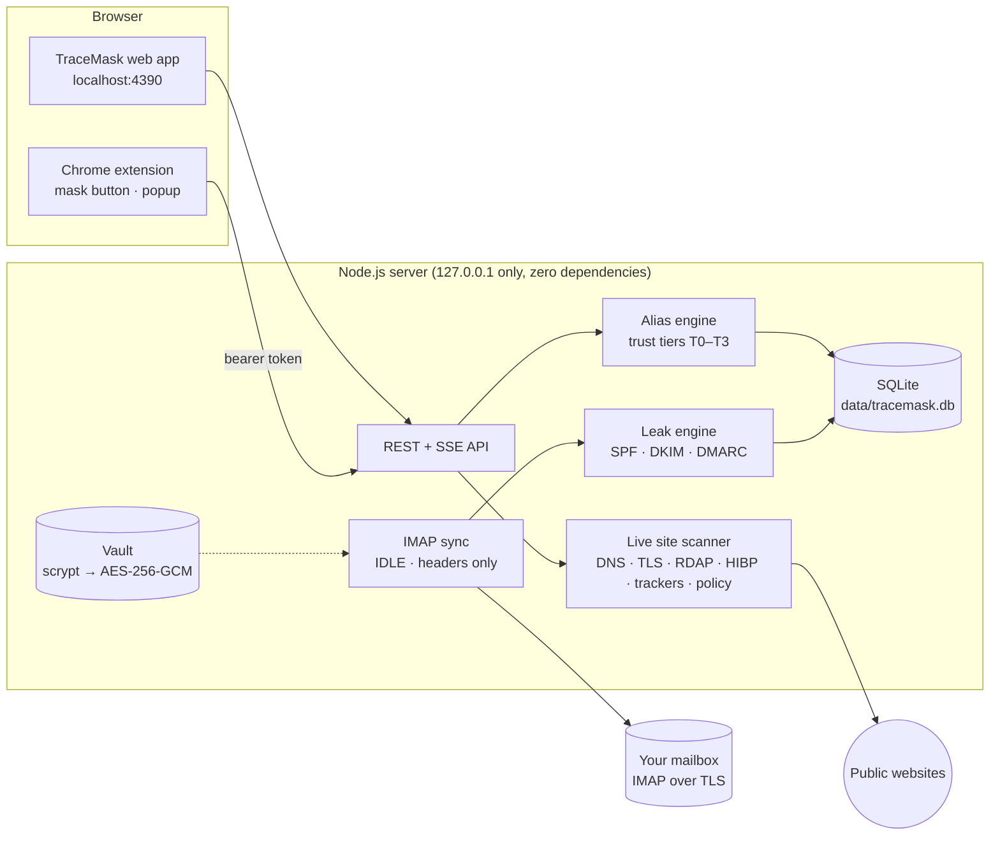

<div align="center">

# TraceMask

### A different you for every website, and proof of who leaked it.

TraceMask is an identity firewall for online sign-ups. It gives every website its own email alias, scans each site's risk live before you sign up, and identifies the company that leaks your address. It is a local-first Node.js web app plus a Chrome extension, with zero dependencies.


**Kalpvruksh 2.0 Mini Hackathon 2026** · Problem **P16**, *Exposure of Personal Identity Through Routine Online Sign-Ups* (Cybersecurity) · **Team Cryptic_Vruksh (T049)**

</div>

---

## Contents

- [Why TraceMask](#why-tracemask)
- [Features](#features)
- [How it works](#how-it-works)
- [Getting started](#getting-started)
- [Chrome extension](#chrome-extension)
- [A 3-minute walkthrough](#a-3-minute-walkthrough)
- [Trust tiers](#trust-tiers)
- [Commands](#commands)
- [Project structure](#project-structure)
- [Security and privacy](#security-and-privacy)
- [Testing](#testing)
- [Documentation](#documentation)
- [FAQ](#faq)
- [Limitations](#limitations)
- [Roadmap ideas](#roadmap-ideas)
- [Contributing](#contributing)
- [Team and license](#team-and-license)

---

## Why TraceMask

Every sign-up form asks for your email address. Once you hand it over, that address becomes a **permanent identifier** that follows you everywhere:

- Companies store it indefinitely, share it with partners, sell it, or lose it in a breach, and **you can never tell which one let it out**.
- Unsubscribing stops the emails but **leaves your data on file**.
- Fake or throwaway addresses **break password recovery** for accounts you actually need.

TraceMask fixes this without giving up real, working email.

## Features

### Web app

| Feature | What it does |
|---|---|
| **Live site-risk scan** | Before you sign up, TraceMask checks the site's TLS certificate, domain age (RDAP), breach history (Have I Been Pwned), trackers (Disconnect list), privacy policy (DPDP/GDPR mentions, grievance officer, sale of data), security headers (HSTS/CSP) and DMARC. It returns a **0–100 risk score** with signal coverage, and a site is never rated "low" when too few signals could be verified. |
| **One alias per site** | Real, deliverable addresses such as `you+myntra-k3x9p@gmail.com` (Gmail plus-addressing) or `myntra-k3x9p@yourdomain.in` (catch-all domain). Welcome mails and password resets keep working. |
| **Leak attribution** | Only one company ever had that alias. When anyone else emails it, TraceMask flags a leak within seconds over **IMAP IDLE**. The evidence is your provider's SPF, DKIM and DMARC results, and lookalike sender domains are flagged for review. |
| **Quarantine** | Leaked or blocked mail is moved to a `TraceMask-Quarantine` folder in your mailbox. Nothing is ever deleted. |
| **Exposure Map** | Every organisation currently emailing your *real* address, with one-click "move to alias" or "request erasure". |
| **Erasure requests** | Formal letters under the DPDP Act 2023 or GDPR Art. 17, with the leak evidence attached and follow-up tracking. |
| **PDF reports** | Leak evidence (raw headers, SHA-256 hashes, evidence digest, chain of custody), sign-up risk assessment, privacy posture and erasure letters. |

### Chrome extension

| Feature | What it does |
|---|---|
| **Mask button in email fields** | Click it on any sign-up page to see the live risk and a recommended tier, then click **Create alias & fill**. It fills the email field and any "confirm email" field, works with React-style forms, and never touches password fields. |
| **Toolbar popup** | The current site's risk, your alias for it (**Fill** / **Copy**), **Rescan**, and your open leaks. |
| **Leak alerts** | A red badge count and a desktop notification. **LOCK** means the vault is locked; **OFF** means the app isn't running. |
| **Shortcuts** | Right-click an input → **Fill TraceMask alias for this site**, or press **Alt+Shift+E**. |
| **Private by design** | The extension talks only to your local app and sends only the address of the page you act on, when you click. Its UI lives in a closed Shadow DOM. |

## How it works



1. **Scan.** The server checks the site against live public sources and scores the risk.
2. **Alias.** You pick what the sign-up is for; TraceMask recommends a trust tier and creates a unique alias bound to that one site.
3. **Watch.** An IMAP IDLE connection reads only the **headers** of new mail (inbox and spam).
4. **Attribute.** If mail for an alias comes from a registrable domain other than the site's, that is a **leak**. It is marked high severity when DKIM/DMARC prove the sender.
5. **Act.** The mail is quarantined, you're alerted, and a PDF evidence report and erasure letter are one click away.

## Getting started

### Requirements

- **Node.js 22.13 or newer.** TraceMask uses the built-in `node:sqlite`, so there are no npm packages to install.
- **A mailbox with IMAP over TLS.** Gmail is recommended. Zoho Mail or any IMAP server on port 993 also works.
- Windows 10/11, macOS or Linux.

### Install and run

```bash
git clone <this-repository-url> tracemask
cd tracemask
npm start
```

On Windows you can also just double-click **`start.bat`**. On macOS and Linux, run **`./start.sh`**.

Then open **http://localhost:4390**, create your master password, and connect your mailbox.

> [!IMPORTANT]
> Your master password is never stored and cannot be recovered. If you forget it, the vault can't be opened.

### Connect Gmail

1. Turn on **2-Step Verification**: myaccount.google.com → Security.
2. Create an **App Password** at myaccount.google.com/apppasswords. Name it "TraceMask" and copy the 16 characters.
3. In TraceMask, choose **Gmail**, enter your address and the app password, then click **Test connection** and **Connect**.

TraceMask reads **headers only** (From, To, Date, Subject, Authentication-Results). It never downloads message bodies.

### Updating

Your data lives in `data/`, which git ignores, so `git pull` updates the code and keeps your vault, aliases and evidence.

## Chrome extension

1. Start TraceMask and unlock it.
2. Open `chrome://extensions` (or `edge://extensions`), switch on **Developer mode**, click **Load unpacked** and select the [`extension`](extension) folder.
3. In TraceMask, go to **Settings → Browser extension → Generate pairing code**.
4. Type the 8-character code on the extension's settings page (it opens by itself) and click **Pair with TraceMask**.
5. Open any sign-up page, click the email field, and click the mask button.

The pairing code works once, expires after 5 minutes and burns after 5 wrong guesses. You can revoke a browser at any time from either side. More details are in [`extension/README.md`](extension/README.md).

## A 3-minute walkthrough

1. **Protect a sign-up.** In TraceMask, open **Protect a sign-up**, enter a real site (for example `dominos.co.in`) and scan it. You'll see the risk score, breaches, trackers and policy findings.
2. **Create an alias.** Choose *Regular use*. TraceMask recommends **T1 Tracked** and creates something like `you+dominos-k3x9p@gmail.com`. Or do it right on the sign-up page with the extension's mask button.
3. **Sign up with it.** The site's welcome mail arrives normally and shows as **Legit**.
4. **Trigger a real leak test.** Send an email to that alias from a *different* domain, such as a college or work account. Within seconds TraceMask raises **Leak detected**, names the sending domain, shows the DKIM/DMARC evidence, and moves the mail to `TraceMask-Quarantine`.
5. **Act.** Download the **evidence PDF** and draft a **DPDP / GDPR erasure request** in one click.

## Trust tiers

| Tier | Best for | Behaviour |
|---|---|---|
| **T0 Burner** | Downloads, trials, coupons | Expires after 24 h (configurable). Mail after expiry is quarantined. |
| **T1 Tracked** | Shopping, newsletters | Every sender other than the site is treated as a leak and quarantined. |
| **T2 Protected** | Accounts you must be able to recover | Leaks are flagged, but mail is never auto-blocked. |
| **T3 Real** | Banks, KYC | Your real address, recorded in the exposure ledger. |

TraceMask recommends a tier from the live risk score plus what the sign-up is for.

## Commands

| Command | What it does |
|---|---|
| `npm start` | Starts the server on http://localhost:4390 |
| `npm test` | CI smoke test. It syntax-checks every file, validates the extension manifest, boots a temporary instance and runs the security probe. |
| `npm run security` | Runs the 32-check security probe against your running instance. Set `TM_PASSWORD` to include the authenticated checks. |
| `npm run check -- myntra.com github.com` | Live self-check. It prints the raw evidence from RDAP, HIBP, TLS, DNS, trackers and the privacy policy. |
| `scripts\self-check.bat` | Windows double-click version of the self-check and probe. It writes reports to `reports/`. |

## Project structure

```
tracemask/
├── server/                    Node.js server (ES modules, node:sqlite, no dependencies)
│   ├── index.js               HTTP server: localhost only, security headers, CSRF / DNS-rebinding / CORS guards
│   ├── vault.js               Master-password vault: scrypt → AES-256-GCM data key, sessions, lockout
│   ├── db.js                  SQLite schema and settings
│   ├── self-check.js          Live self-check (npm run check)
│   ├── api/
│   │   ├── routes.js          Web app API
│   │   └── ext.js             Browser-extension API: pairing, lookup, scan, alias, leaks
│   └── lib/
│       ├── scanner.js         Live site-risk scanner and risk score
│       ├── net-guard.js       SSRF guard: public IPs only, on every redirect hop
│       ├── imap.js            IMAP4rev1 client over TLS (IDLE, MOVE, UIDPLUS, SPECIAL-USE)
│       ├── sync.js            Header sync, attribution, quarantine, exposure map
│       ├── leak-engine.js     Leak / legit / lookalike verdicts
│       ├── mail-headers.js    RFC 5322 and Authentication-Results parsing
│       ├── aliases.js         Alias generation and trust-tier policy
│       ├── identity.js        Shared site and identity service (web app + extension)
│       ├── reports.js, pdf.js PDF 1.7 reports with evidence digests
│       ├── erasure.js         DPDP / GDPR erasure letters
│       └── psl.js, trackers.js Public Suffix List and tracker classification
├── public/                    Web app (vanilla JS single-page app, strict CSP)
├── extension/                 Chrome extension (Manifest V3): service worker, content script, popup, options
├── tests/
│   ├── ci.mjs                 npm test
│   └── security-probe.mjs     OWASP-style probe: 24 web + 8 extension-API checks
├── scripts/self-check.bat     Windows self-check helper
├── docs/                      User guide, pitch deck, presentation script, sample reports
├── start.bat, start.sh        One-click start
└── data/                      Created at runtime: your vault and database (git-ignored)
```

## Security and privacy

| Area | Control |
|---|---|
| **Secrets** | The master password is never stored. scrypt (N=2^15) derives a key that unwraps a random 256-bit data key, and the IMAP password is sealed with AES-256-GCM. Failed unlocks trigger an escalating lockout. |
| **Network** | The server listens on `127.0.0.1` only. A Host-header allow-list blocks DNS rebinding. Every write needs a custom header and the same origin, which blocks CSRF. |
| **Browser** | Strict Content-Security-Policy with no inline scripts, `frame-ancestors 'none'`, nosniff, no-referrer and COOP/CORP. The session cookie is HttpOnly and SameSite=Strict. All data is rendered as text. |
| **Scanner** | SSRF-guarded: loopback, private, link-local, CGNAT and cloud-metadata addresses are refused on every hop. |
| **Mail** | IMAP is TLS-only (port 993) and reads headers only. Evidence headers are kept with SHA-256 hashes. |
| **Extension** | A one-time pairing code issues a 256-bit per-browser key, stored hashed. Cookies never authenticate the extension API and web origins get a 403. Page scripts can only look up their own site. |
| **Lock** | Locking the vault locks the web app and the extension alike. |
| **Supply chain** | Zero third-party npm packages. |

To report a vulnerability, please follow [SECURITY.md](SECURITY.md).

## Testing

- **`npm test`** runs in CI on Node 22 and 24 (see `.github/workflows/ci.yml`): it checks syntax, validates the extension manifest, boots a throw-away instance and runs the security probe.
- **`npm run security`**: all **32/32** checks pass on v1.2, covering headers, DNS rebinding, CSRF, path traversal, malformed URLs, oversized bodies, SQL and IMAP injection, prototype pollution, SSRF, brute force and the extension API.
- **End to end:** during development, the extension was verified with **52 automated browser checks**. They cover pairing, inline fill on a React-style form under strict CSP, the popup, leak alerts through IMAP IDLE, lock and offline states, revocation, and installing while a sign-up tab is already open.
- **Real data:** `npm run check` scans real websites and prints the raw evidence, so you can see nothing is simulated.

## Documentation

| Document | Contents |
|---|---|
| [User guide (PDF)](docs/user-guide.pdf) | Install, first run, protecting sign-ups, Leak Center, Exposure Map, reports, extension, security, troubleshooting |
| [Pitch deck (PPTX)](docs/presentation/pitch-deck.pptx) · [PDF](docs/presentation/pitch-deck.pdf) | Hackathon presentation |
| [Presentation script (PDF)](docs/presentation/presentation-script.pdf) | Simple speaker script for the pitch |
| [Sample risk assessment](docs/sample-reports/risk-assessment-dominos-co-in.pdf) | Real live scan of dominos.co.in |
| [Sample leak evidence report](docs/sample-reports/leak-evidence-report-test-mailbox.pdf) | From a test mailbox that uses reserved `.example` domains |
| [Changelog](CHANGELOG.md) | What changed in each version |

## FAQ

<details>
<summary><b>Does TraceMask read my emails?</b></summary>

No. It reads only message **headers** (From, To, Date, Subject, Authentication-Results) and never downloads bodies. For leak evidence, the raw headers of the flagged mail are stored locally with SHA-256 hashes.
</details>

<details>
<summary><b>Where is my data stored? Is anything sent to a server?</b></summary>

Everything stays in the `data/` folder on your computer, and there is no TraceMask cloud. The only outbound connections are:

- your own IMAP connection;
- the live checks you trigger (the site itself, RDAP, Have I Been Pwned, DNS);
- periodic downloads of the public Public Suffix List and the Disconnect tracker list.
</details>

<details>
<summary><b>Will password resets still work with an alias?</b></summary>

Yes. Aliases are real, deliverable addresses that arrive in your normal inbox. Use **T2 Protected** for accounts you must be able to recover, since those are never auto-blocked.
</details>

<details>
<summary><b>Can a site just remove the <code>+tag</code>?</b></summary>

A determined spammer can turn `you+tag@gmail.com` into `you@gmail.com`. For full unlinkability, use **catch-all domain mode** with your own domain.
</details>

<details>
<summary><b>How do I know a leak isn't a false alarm?</b></summary>

Verdicts use the sender's registrable domain plus your provider's SPF/DKIM/DMARC results. Same-brand lookalike domains are flagged for **review**, not as leaks. If a legitimate sender is flagged, mark it *Not a leak (same company)* and it is trusted for that site from then on.
</details>

<details>
<summary><b>Does the extension work in Edge or Brave?</b></summary>

Yes. It works in any Chromium browser from version 116: load the `extension` folder unpacked the same way.
</details>

## Limitations

- Plus-addressing can be stripped by a determined spammer. Use catch-all domain mode for full separation.
- A leak verdict proves the alias left the original site. It can't tell a sale apart from a breach.
- DPDP Act data-principal obligations apply from 13 May 2027 under the phased DPDP Rules 2025. Until then, the erasure letter is a formal request.
- The local SQLite database is not encrypted at rest; only the mailbox password is. Use full-disk encryption (BitLocker / FileVault).
- The extension's inline button works in the page's main frame. For sign-up forms inside embedded frames, use the popup's **Copy**.

## Roadmap ideas

These are ideas, not commitments:

- [ ] Firefox version of the extension
- [ ] OAuth sign-in for Gmail and Microsoft 365, instead of app passwords
- [ ] Encrypted-at-rest database
- [ ] Chrome Web Store listing
- [ ] Shared team or family vaults

## Contributing

Contributions are welcome. Please read [CONTRIBUTING.md](CONTRIBUTING.md). The short version:

- Keep TraceMask zero-dependency.
- Never commit anything from `data/`.
- Run `npm test` before opening a pull request.

## Team and license

Built by **Team Cryptic_Vruksh** (Team ID T049) for the **Kalpvruksh 2.0 Mini Hackathon 2026**, problem statement P16: *Exposure of Personal Identity Through Routine Online Sign-Ups*.

TraceMask queries these public sources live when you scan a site. Nothing is bundled.

- Public Suffix List (publicsuffix.org)
- Disconnect tracking-protection list
- Have I Been Pwned breach catalogue
- RDAP registries

Released under the [MIT License](LICENSE) © 2026 Team Cryptic_Vruksh.
