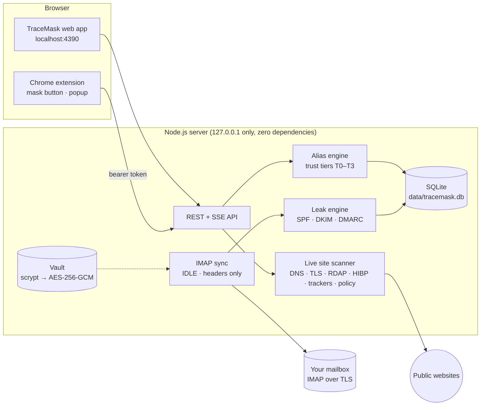

<div align="center">

# TraceMask

**A different you for every website, and proof of who leaked it.**

An identity firewall for online sign-ups: a web app and a Chrome extension that give every website its own real email alias, check a site's risk before you sign up, and catch the company that leaks or sells your address.


Kalpvruksh 2.0 Mini Hackathon 2026 · Problem P16 (Cybersecurity) · Team Cryptic_Vruksh (T049)

</div>

---

## The problem

Every sign-up form asks for your email address. Once you give it, that address becomes a permanent identifier. It is stored indefinitely, shared with partners, sold, or exposed in breaches, and you can never tell which company let it out. Unsubscribing stops the emails but leaves your data on file. Fake addresses break password recovery.

## What TraceMask does

| Step | What happens |
|---|---|
| **1. Check before you sign up** | A live scan checks the site's TLS certificate, domain age (RDAP), breach history (Have I Been Pwned), trackers (Disconnect list), privacy policy, security headers and DMARC. It gives a 0–100 risk score with signal coverage. |
| **2. A different you for every site** | Each site gets its own real, deliverable alias, such as `you+myntra-k3x9p@gmail.com` (Gmail plus-addressing) or `myntra-k3x9p@yourdomain.in` (catch-all domain). Welcome mails and password resets still arrive. |
| **3. Proof of who leaked it** | Only one company ever had that alias. If anyone else emails it, TraceMask flags the leak within seconds over IMAP IDLE. The evidence comes from your provider's SPF, DKIM and DMARC results, and the mail is moved to a `TraceMask-Quarantine` folder. Nothing is deleted. |
| **4. Act on it** | Compliance-style PDF evidence reports carry a SHA-256 evidence digest. Erasure-request letters cite the DPDP Act 2023 or GDPR Art. 17 and are tracked for follow-up. |

The Exposure Map lists every organisation that currently emails your *real* address, with one-click "move to alias" or "request erasure" for each.

### Trust tiers

| Tier | For | Behaviour |
|---|---|---|
| **T0 Burner** | Downloads, trials, coupons | Expires after 24 h (configurable). Mail after expiry is quarantined. |
| **T1 Tracked** | Shopping, newsletters | Every sender other than the site is treated as a leak. |
| **T2 Protected** | Accounts you must recover | Leaks are flagged, but mail is never auto-blocked. |
| **T3 Real** | Banks, KYC | Your real address, recorded in the exposure ledger. |

TraceMask recommends a tier from the live risk score and what the sign-up is for.

## Chrome extension

The extension brings TraceMask into the sign-up form itself:

- **Mask button in email fields.** Click it to see the site's live risk, pick what the sign-up is for, then click **Create alias & fill**. The alias goes into the email field and any "confirm email" field. Password fields are never touched.
- **Toolbar popup.** Shows the current site's risk, your alias for it (Fill or Copy), a rescan button and open leaks.
- **Leak alerts.** The icon shows a red badge count and you get a desktop notification. **LOCK** means the vault is locked; **OFF** means the app is not running.
- **Right-click and keyboard.** Right-click an input and choose **Fill TraceMask alias for this site**, or press **Alt+Shift+E**.

The extension talks only to your local TraceMask app. See [`extension/README.md`](extension/README.md).

## How it works



## Quick start

**Requirements:** [Node.js](https://nodejs.org) 22.13 or newer, and a mailbox with IMAP. Gmail is recommended. TraceMask has no npm dependencies, so there is nothing to install.

```bash
git clone <this-repository-url> tracemask
cd tracemask
npm start            # or double-click start.bat on Windows, or run ./start.sh on macOS/Linux
```

Open **http://localhost:4390**, create a master password, then connect your mailbox.

### Connecting Gmail

1. Turn on 2-Step Verification at myaccount.google.com → Security.
2. Create an **App Password** at myaccount.google.com/apppasswords and copy the 16 characters.
3. In TraceMask, choose **Gmail**, enter your address and the app password, then click **Test connection** and **Connect**.

TraceMask reads **headers only** (From, To, Date, Subject, Authentication-Results). It never downloads message bodies.

### Installing the Chrome extension

1. Open `chrome://extensions` (or `edge://extensions`), turn on **Developer mode**, click **Load unpacked** and select the [`extension`](extension) folder.
2. In TraceMask, go to **Settings → Browser extension → Generate pairing code**.
3. Type the code on the extension's settings page and click **Pair with TraceMask**.

## Commands

| Command | What it does |
|---|---|
| `npm start` | Starts the server on http://localhost:4390 |
| `npm test` | CI smoke test. It syntax-checks every file, validates the extension manifest, boots a temporary instance and runs the security probe. |
| `npm run security` | Runs the 32-check security probe against your running instance. Add `TM_PASSWORD=...` for the authenticated checks. |
| `npm run check -- myntra.com github.com` | Live self-check. It prints the raw evidence from RDAP, HIBP, TLS, DNS, trackers and the privacy policy. |
| `scripts\self-check.bat` | Double-click version of the self-check and probe. It writes text reports to `reports/`. |

## Project structure

```
tracemask/
├── server/                 Node.js server (ES modules, node:sqlite, no dependencies)
│   ├── index.js            HTTP server: localhost only, security headers, CSRF, DNS-rebinding and CORS guards
│   ├── vault.js            Master-password vault: scrypt → AES-256-GCM data key, sessions, lockout
│   ├── db.js               SQLite schema and settings
│   ├── api/routes.js       Web app API
│   ├── api/ext.js          Browser-extension API: pairing, lookup, scan, alias, leaks
│   ├── self-check.js       Live self-check (npm run check)
│   └── lib/                scanner, net-guard (SSRF), imap, sync, leak-engine, aliases, identity,
│                           mail-headers, psl, trackers, reports + pdf (PDF 1.7 writer), erasure
├── public/                 Web app (vanilla JS single-page app, strict CSP)
├── extension/              Chrome extension (Manifest V3): service worker, content script, popup, options
├── tests/
│   ├── ci.mjs              npm test
│   └── security-probe.mjs  OWASP-style probe (24 web + 8 extension-API checks)
├── scripts/self-check.bat  Windows self-check helper
├── docs/                   User guide, pitch deck, presentation script, sample reports
├── start.bat / start.sh    One-click start
└── data/                   Created at runtime: your vault and database (git-ignored)
```

## Security

- **Secrets.** The master password is never stored. scrypt (N=2^15) derives a key that unwraps a random 256-bit data key, and the IMAP password is sealed with AES-256-GCM. Failed unlocks trigger an escalating lockout.
- **Network exposure.** The server binds to `127.0.0.1` only. A Host-header allow-list blocks DNS rebinding. Every write needs a custom header and the same origin, which blocks CSRF.
- **Browser.** Strict Content-Security-Policy with no inline scripts, `frame-ancestors 'none'`, nosniff, no-referrer and COOP/CORP. The session cookie is HttpOnly and SameSite=Strict. All data is rendered as text.
- **Scanner.** Every request and redirect hop must resolve to a public IP. Loopback, private, link-local, CGNAT and cloud-metadata addresses are refused, which prevents SSRF.
- **Mail.** IMAP is TLS-only on port 993 and reads headers only. Evidence headers are stored with SHA-256 hashes.
- **Extension.** A one-time pairing code (5 minutes, 5 guesses) issues a 256-bit per-browser key, stored hashed. Cookies never authenticate the extension API and web origins are refused. The in-page UI lives in a closed Shadow DOM. Scripts inside web pages can only look up their own site.
- **Lock.** Locking the vault locks the web app and the extension alike.
- **Supply chain.** There are zero third-party npm packages.

`npm run security` checks all of this: 32/32 pass on v1.2. During development the extension was also verified with 52 automated end-to-end browser checks. See [SECURITY.md](SECURITY.md) to report a vulnerability.

## Documentation

| Document | |
|---|---|
| [User guide (PDF)](docs/user-guide.pdf) | Install, first run, protecting sign-ups, Leak Center, Exposure Map, reports, extension, security, troubleshooting |
| [Pitch deck (PPTX)](docs/presentation/pitch-deck.pptx) · [PDF](docs/presentation/pitch-deck.pdf) | Hackathon presentation |
| [Presentation script (PDF)](docs/presentation/presentation-script.pdf) | Speaker script for the pitch |
| [Sample risk assessment](docs/sample-reports/risk-assessment-dominos-co-in.pdf) | Real live scan of dominos.co.in |
| [Sample leak evidence report](docs/sample-reports/leak-evidence-report-test-mailbox.pdf) | From a test mailbox that uses reserved `.example` domains |

## Honest limitations

- Plus-addressing can be stripped by a determined spammer (`you+tag@` → `you@`). Use catch-all domain mode for full unlinkability.
- A leak verdict proves the alias left the original site. It can't tell a sale apart from a breach.
- DPDP Act data-principal obligations apply from 13 May 2027 under the phased DPDP Rules 2025. Until then, the erasure letter is a formal request.
- The local SQLite database is not encrypted at rest; only the mailbox password is. Use full-disk encryption (BitLocker/FileVault).
- The extension's inline button works in the page's main frame. Sign-up forms inside embedded frames can use the alias from the popup instead.

## Data sources

TraceMask queries these public sources live, at the moment you scan a site. Nothing is bundled.

- Public Suffix List (publicsuffix.org)
- Disconnect tracking-protection list
- Have I Been Pwned breach catalogue
- RDAP registries
- The site itself

## Team

Built by **Team Cryptic_Vruksh** (Team ID T049) for the Kalpvruksh 2.0 Mini Hackathon 2026, problem statement P16: *Exposure of Personal Identity Through Routine Online Sign-Ups*.

## License

[MIT](LICENSE) © 2026 Team Cryptic_Vruksh
